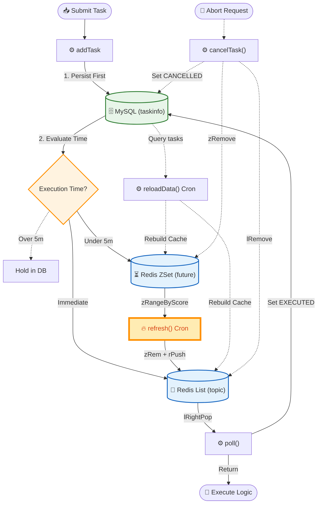

# 🚀 Distributed Microservices Content Platform (LeadNews)


A cloud-native microservices project for open news publishing, content distribution, and user behavior processing. Readers can apply to become creators; approved applicants receive a Wemedia account for submitting and scheduling articles. The platform uses **Spring Cloud Gateway** and **Consul** for routing and service discovery, **Apache Kafka** for event-driven integration, **MinIO** and **AWS Rekognition** for media processing, and a polyglot persistence layer built on **MySQL, Redis, MongoDB, and Elasticsearch**.

---

## 🛠️ Tech Stack & Key Metrics

*   **Backend Ecosystem**: Java 17, Spring Boot 3.5, Spring Data JPA, Spring Cloud Gateway, Consul (Service Discovery).
*   **Data & Search Layer**: MySQL (Primary), MongoDB (Behavior Logs), Elasticsearch (Full-Text Search).
*   **Streaming & Caching**: Apache Kafka, Redis (ZSet, List, Pipeline).
*   **Infrastructure & Cloud**: MinIO (Static Hosting), AWS Rekognition (AI Moderation).
*   **📈 Performance Impact**: 
    *   Slashed user-facing API latency from **~2s to <20ms** via Kafka async decoupling.
    *   Increased task processing throughput by **300%** using Redis Pipeline batching.

---

## 🏗️ System Architecture

The system is strictly layered to separate routing, business logic, asynchronous messaging, and persistence.

<div align="center">
  
</div>

<br>


---

## 💎 Under the Hood: Engineering Highlights


### 1. High-Concurrency Task Scheduler (Redis ZSet + Pipeline)
Built a hybrid MySQL-Redis scheduling engine. Future tasks are pushed to a Redis `ZSet` (scored by execution time). A distributed cron job fetches expired tasks and migrates them to a Ready `List`. To eliminate network RTT overhead during this migration, **Redis Pipeline** batching was introduced.



### 2. Event-Driven Messaging with Kafka
Kafka decouples cross-service article updates from the main request flow. Article publication events update the Elasticsearch index, while article up/down events synchronize publication state. User reactions and creator follows are synchronous, transactional operations owned directly by the Behavior service.

### 3. Static Article Generation
When an article is published, the Article service renders its content into a static HTML page with Freemarker and stores the generated file in MinIO. Readers can retrieve the pre-rendered page without rebuilding the article view from multiple database records on every request. After generation, the service also publishes a Kafka event to update the Elasticsearch index.

---

## 🚀 Backend Quick Start

This repository contains the backend services only. The frontend build artifacts and machine-specific Nginx configuration are not included.

### Prerequisites

- JDK 17 and Maven 3.8+
- Docker and Docker Compose
- MySQL with the required LeadNews schemas and tables
- `MYSQL_PASSWORD` set in the local environment; `MYSQL_USERNAME` defaults to `root`

AWS credentials with `rekognition:DetectModerationLabels` permission are optional and are required only for real image moderation. Configure them locally with `aws configure`. The Wemedia service uses `us-west-2` by default; set `AWS_REGION` to use another region. Credentials are loaded through the AWS SDK default credential chain and must not be committed to this repository.

### Start Infrastructure

From the repository root, start Consul, Redis, ZooKeeper, Kafka, Elasticsearch, MongoDB, and MinIO:

```bash
docker compose up -d
```

Verify the containers before starting the applications:

```bash
docker compose ps
```

MySQL is not included in the Compose file and must be started separately. The files under `scripts/database` are incremental migrations, not a complete baseline schema.

### Start Applications

After the infrastructure is ready, start the seven business services:

1. `leadnews-schedule` (51701)
2. `leadnews-user` (51801)
3. `leadnews-article` (51802)
4. `leadnews-wemedia` (51803)
5. `leadnews-search` (51804)
6. `leadnews-behavior` (51805)
7. `leadnews-admin` (51806)

Then start the three gateways:

1. `leadnews-app-gateway` (51601)
2. `leadnews-wemedia-gateway` (51602)
3. `leadnews-admin-gateway` (51603)

The applications register with Consul at `http://localhost:8500`. Starting a gateway before its downstream services is possible, but requests will fail until the required services have registered and become healthy.

### Optional Frontend Proxy

When using a separately obtained frontend build, Nginx can serve its static assets and reverse-proxy API requests to the three gateways listed above. The frontend assets and Nginx configuration are intentionally excluded because they are external, machine-specific resources. The backend can be exercised directly through the gateway ports without Nginx.
