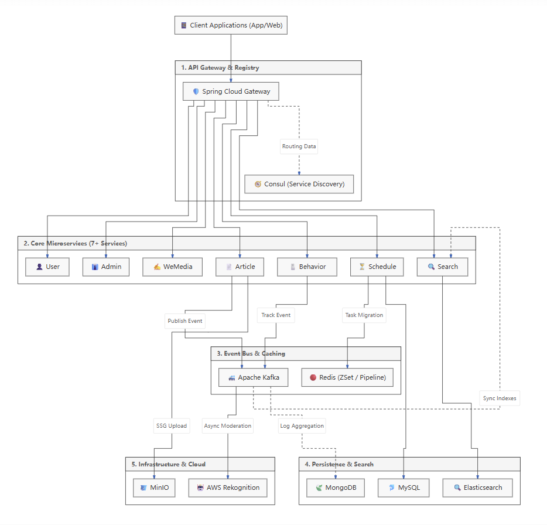
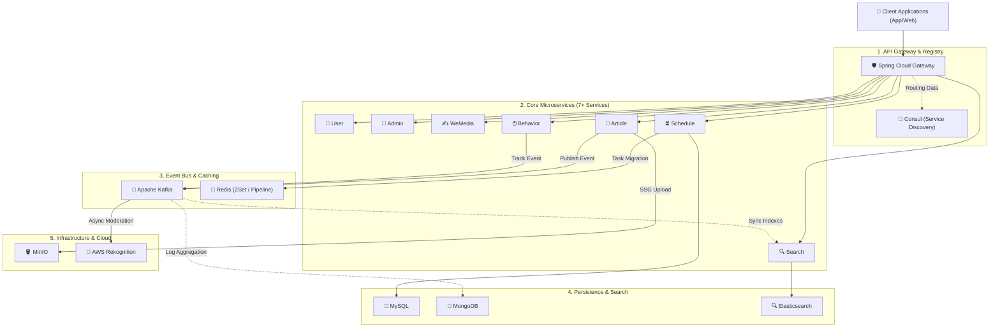

# 🚀 Distributed Microservices Content Platform (LeadNews)


A highly scalable, cloud-native microservices ecosystem for digital publishing, content syndication, and user behavior analytics. Designed to handle extreme high-throughput traffic, this platform is routed by **Spring Cloud Gateway** and **Consul** for dynamic service discovery. It relies on **Apache Kafka** for event-driven decoupling, integrates **MinIO** and **AWS Rekognition**, and leverages a polyglot persistence layer (**MySQL, Redis, MongoDB, Elasticsearch**) to ensure sub-millisecond data delivery and robust consistency.

---

## 🛠️ Tech Stack & Key Metrics

*   **Backend Ecosystem**: Java 17, Spring Boot 3.2, Spring Data JPA, Spring Cloud Gateway, Consul (Service Discovery).
*   **Data & Search Layer**: MySQL (Primary), MongoDB (Behavior Logs), Elasticsearch (Full-Text Search).
*   **Streaming & Caching**: Apache Kafka, Redis (ZSet, List, Pipeline).
*   **Infrastructure & Cloud**: MinIO (Static Hosting), AWS Rekognition (AI Moderation).
*   **📈 Performance Impact**: 
    *   Slashed user-facing API latency from **~2s to <20ms** via Kafka async decoupling.
    *   Increased task processing throughput by **300%** using Redis Pipeline batching.

---

## 🏗️ System Architecture

The system is strictly layered to separate routing, business logic, asynchronous messaging, and persistence.

<div align="center">
  
</div>

<br>

<details>
<summary><b>👨‍💻 View Mermaid Source Code (For IDE Rendering)</b></summary>



</details>

---

## 💎 Under the Hood: Engineering Highlights


### 1. High-Concurrency Task Scheduler (Redis ZSet + Pipeline)
Built a hybrid MySQL-Redis scheduling engine. Future tasks are pushed to a Redis `ZSet` (scored by execution time). A distributed cron job fetches expired tasks and migrates them to a Ready `List`. To eliminate network RTT overhead during this migration, **Redis Pipeline** batching was introduced.


### 2. Event-Driven Moderation Pipeline
*   **Problem**: Image moderation via AWS Rekognition is an external operation and should not block the article submission request.
*   **Solution**: Submitted articles are placed in the Schedule service's Redis-backed delayed-task queue. The Wemedia service polls ready tasks and performs moderation asynchronously, while conditional database updates protect each review state transition.

### 3. Static Site Generation for Extreme Read Scaling
*   **Problem**: Serving popular articles triggered complex SQL `JOIN` queries, threatening database stability during traffic spikes.
*   **Solution**: Engineered an SSG pipeline that pre-renders dynamic article data into static HTML files at publish time. These files are distributed to **MinIO**.
*   **Impact**: Completely bypassed relational database reads for content delivery, supporting **10,000+ concurrent readers** with sub-millisecond page loads.

---

## 🚀 Quick Start

### Prerequisites
- JDK 17 & Maven 3.8+
- Docker & Docker Compose
- Consul (Port 8500)
- AWS credentials with `rekognition:DetectModerationLabels` permission for real image moderation

Configure credentials locally with `aws configure`. The Wemedia service uses `us-west-2` by default; set `AWS_REGION` to use another region. Credentials are loaded through the AWS SDK default credential chain and must not be committed to this repository.

### Infrastructure Setup
Spin up the required middleware using the provided compose file:
```bash
docker-compose -f docker/docker-compose.yml up -d
```
*(Ensure MySQL, Redis, MongoDB, Elasticsearch, Kafka, and Consul are running healthily).*

### Bootstrapping Services
Start the API Gateway first, followed by the core microservices:
1. `leadnews-gateway` (Port 51601)
2. `leadnews-user` (Port 51801)
3. `leadnews-article` (Port 51802)
4. *(Start additional services as needed via IntelliJ IDEA Run Dashboard).*
