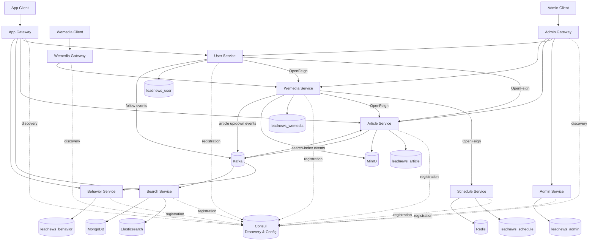

# LeadNews – Cloud-Native Microservices Content Platform

A Spring Cloud microservices project for content publishing, content moderation, delayed task scheduling, and article search, with an emphasis on security, data integrity, and reproducible local development.

## 🚀 Engineering Highlights

- **Cloud-Native Infrastructure & Service Discovery**
  Uses **HashiCorp Consul** for service discovery and configuration. Consul, Redis, Kafka, ZooKeeper, Elasticsearch, MongoDB, and MinIO are orchestrated with `docker-compose` for local development; MySQL runs separately.
- **Trust & Safety Content Moderation Pipeline**
  Implements an asynchronous content-moderation workflow for user-generated content. The current local implementation mocks AWS Rekognition latency and results; the AWS SDK dependency and an example production integration for moderation labels and OCR are included in the code.
- **Data Integrity & API Type Purity**
  Uses field-level Jackson serialization (`@JsonSerialize(using = ToStringSerializer.class)`) for 64-bit IDs that would otherwise exceed JavaScript's safe-integer range, while retaining numeric types inside the Java application.
- **API Gateway Authentication & Context Propagation**
  Spring Cloud Gateway filters use exact login and health-check allowlists, validate JWTs for protected routes, and overwrite the downstream `userId` request header with the authenticated identity (`httpHeaders.set("userId", ...)`) before routing the request.
- **State-Machine Concurrency Control (Delayed Tasks)**
  Resolved critical race conditions in the `leadnews-schedule` delayed task queue using a state-machine conditional update (`SCHEDULED → EXECUTED` or `CANCELLED`). Utilized SQL-style guards to prevent execute/cancel concurrent overwrites.

## 🛠 Tech Stack

- **Backend Foundation:** Java 17, Spring Boot 3.5.15, Spring Cloud 2025.0.3
- **API Documentation:** Springdoc OpenAPI 2.8.13
- **Service Discovery & Config:** HashiCorp Consul, Spring Cloud Gateway Server WebFlux, OpenFeign
- **Persistence:** MySQL 8 with Spring Data JPA/Hibernate across all relational persistence modules; MongoDB stores search history
- **Object Storage:** AWS S3 API compatibility via MinIO
- **Message Broker & Async:** Apache Kafka, Redis (ZSet + List for delayed queues)
- **Search Engine:** Elasticsearch 8.18.8 and the Spring Boot-managed Elasticsearch Java client 8.18.8
- **AI & Moderation:** Local AWS Rekognition mock with AWS SDK integration example

## 🏗 System Architecture

LeadNews is organized as a Maven multi-module microservice application. Three Spring Cloud Gateway applications provide separate entry points for app users, content creators, and administrators. Gateway filters validate JWTs, replace the downstream `userId` header with the authenticated identity, and route requests through Consul service discovery.



### Communication and data ownership

- **Synchronous calls:** OpenFeign interfaces in `leadnews-feign-api` support user-to-article, user-to-wemedia, wemedia-to-article, and wemedia-to-schedule calls.
- **Asynchronous events:** Kafka carries follow events, article up/down events, and article search-index synchronization events.
- **Database per service:** The main business services use separate MySQL schemas; the search service instead uses Elasticsearch for article search and MongoDB for search history.
- **Object storage:** The article and wemedia services use MinIO for generated article pages and media assets.
- **Delayed scheduling:** MySQL stores durable task records, while Redis holds tasks that are close to execution.

### Scheduled publishing flow

```text
Wemedia submission
    -> create delayed task through OpenFeign
    -> persist task in leadnews_schedule
    -> cache near-term task in Redis ZSet
    -> move due task to Redis List (scheduled refresh)
    -> wemedia polls the ready task
    -> moderation/publishing workflow
    -> article service persists the article and generates static HTML
    -> upload static content to MinIO
    -> publish Kafka event
    -> search service updates the Elasticsearch index
```

The schedule service uses a guarded state transition in MySQL so that concurrent cancel and poll operations cannot both finalize the same task:

```text
SCHEDULED -> CANCELLED
SCHEDULED -> EXECUTED
```

The transition is implemented as a JPQL conditional update that also increments the optimistic-lock version. The affected-row count selects the race winner. Updating the task log and deleting the active `taskinfo` row run in one database transaction; Redis operations remain outside that transaction and startup/periodic reload can rebuild near-term cache entries from MySQL.

Tasks due within five minutes are cached in Redis. Future tasks use a ZSet scored by execution time, ready tasks use a List, a scheduled refresh moves due entries from the ZSet to the List every minute, and a five-minute reload job rebuilds the near-term Redis cache from MySQL.

## 📦 Modules

| Module | Description |
|---|---|
| `leadnews-gateway` | Global entry point, Auth Filters, CORS, and Routing (`app`, `wemedia`, `admin`) |
| `leadnews-service/leadnews-user` | User identity, profiles, and authentication |
| `leadnews-service/leadnews-article` | Article management, storage, and static HTML generation |
| `leadnews-service/leadnews-wemedia` | Creator platform, content submission, and moderation workflow (local Rekognition mock) |
| `leadnews-service/leadnews-schedule` | Delayed task scheduling with Redis and guarded state transitions |
| `leadnews-service/leadnews-search` | Elasticsearch indexing and Mongo-backed user search history |
| `leadnews-service/leadnews-behavior` | User behavior tracking (likes, follows, reads) |
| `leadnews-service/leadnews-admin` | Administration, channels, and sensitive-word management |

### Local ports and service IDs

| Component | Consul service ID | Port |
|---|---|---:|
| App Gateway | `leadnews-app-gateway` | 51601 |
| Wemedia Gateway | `leadnews-wemedia-gateway` | 51602 |
| Admin Gateway | `leadnews-admin-gateway` | 51603 |
| Schedule Service | `leadnews-schedule` | 51701 |
| User Service | `leadnews-user` | 51801 |
| Article Service | `leadnews-article` | 51802 |
| Wemedia Service | `leadnews-wemedia` | 51803 |
| Search Service | `leadnews-search` | 51804 |
| Behavior Service | `leadnews-behavior` | 51805 |
| Admin Service | `leadnews-admin` | 51806 |
| Consul | — | 8500 |
| Kafka | — | 9092 |
| Elasticsearch | — | 9200 |
| MongoDB | — | 27017 |
| Redis | — | 6379 |
| MinIO API / Console | — | 9000 / 9001 |

## 🚦 Quick Start

### 1. Start Infrastructure (Docker Compose)
The repository includes a Compose file for the infrastructure dependencies other than MySQL.
```bash
docker compose up -d
```
*This will spin up Consul (port 8500), Redis, Kafka, Zookeeper, Elasticsearch, MongoDB, and MinIO.*

> If you already have an older Elasticsearch container, export or discard its local indexes before recreating it. The 8.18.8 service uses the named volume `elasticsearch-data`; data stored only inside the old container is not migrated automatically.

### 2. Configure Local Database
Ensure you have a local MySQL instance running on `localhost:3306`. MySQL is excluded from Docker Compose to prevent conflicts with existing local development environments. The username defaults to `root`; the password must be supplied through `MYSQL_PASSWORD`.

macOS/Linux:

```bash
export MYSQL_USERNAME=root
export MYSQL_PASSWORD='your-local-password'
```

Windows PowerShell:

```powershell
$env:MYSQL_USERNAME = 'root'
$env:MYSQL_PASSWORD = 'your-local-password'
```

These variables are used by all MySQL-backed services and the Elasticsearch initialization utility. Do not commit real database credentials to the repository.

For an existing `leadnews_article` schema, apply the one-time author idempotency constraint before starting the Article service:

```bash
mysql -u root -p < scripts/database/20261001_add_ap_author_user_id_unique.sql
```

The script first reports duplicate `user_id` values. If it reports any rows, reconcile those authors before applying the `ALTER TABLE` statement.

For an existing `leadnews_wemedia` schema, apply the equivalent account idempotency constraint before starting the Wemedia service:

```bash
mysql -u root -p < scripts/database/20261001_add_wm_user_ap_user_id_unique.sql
```

This script reports duplicate non-null `ap_user_id` values before adding the unique constraint.

### 3. Build & Run
Install JDK 17. The Maven wrapper included in the repository provides the required Maven version.

Build all modules and produce executable Spring Boot JARs while skipping tests:
```bash
./mvnw clean verify -DskipTests
```

On Windows PowerShell, use `./mvnw.cmd` instead of `./mvnw`.

Launch the applications from your IDE or run their packaged JARs. For example:

```bash
java -jar leadnews-gateway/leadnews-app-gateway/target/leadnews-app-gateway-0.0.1-SNAPSHOT.jar
java -jar leadnews-service/leadnews-user/target/leadnews-user-0.0.1-SNAPSHOT.jar
```

The applications load external configuration through `spring.config.import=consul:` and register with the local Consul agent at `http://localhost:8500`. The legacy bootstrap starter is not used. Gateway health checks use `/actuator/health`, which is available without a JWT.

## 🧪 Testing Concurrency (Schedule Service)

**1) Isolated JPA concurrency test (H2, no external services required)**
```bash
./mvnw -pl leadnews-service/leadnews-schedule -am test
```

The 200-task MySQL/Redis stress test is opt-in. Start MySQL and Redis, configure the database credentials, set `RUN_SCHEDULE_STRESS_TEST=true`, and run `TaskRaceConditionStressTest`.

**2) Python HTTP Race Script**
Start `leadnews-schedule` (port `51701`), then run:
```bash
python scripts/task_race_stress.py --tasks 200 --workers 8
```
Expect: `cancel_success + poll_success == tasks` (each task is finalized exactly once).

The script also writes per-task cancel/poll outcomes to `task_race_results.csv` by default. Use `--output <path>` to choose another location.
